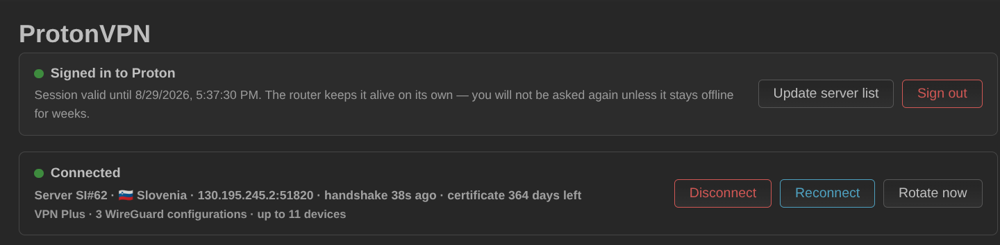
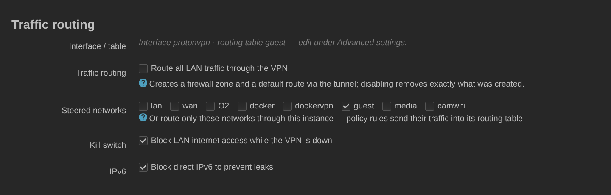
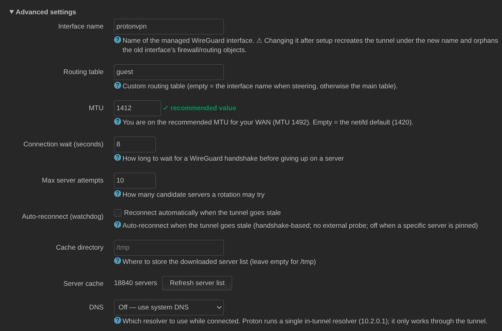

# ProtonVPN WireGuard für OpenWrt

[English](README.md) · [Русский](README.ru.md) · **Deutsch**

Richtet den WireGuard-Dienst von ProtonVPN unter OpenWrt ein: SRP-6a-Anmeldung
im Browser samt TOTP-Unterstützung, lokal erzeugte WireGuard-Schlüssel, die als
Proton-Zertifikate registriert werden, eine authentifizierte Serverliste mit
Last und Score, ein Standort-Set zum Verbinden und Rotieren (Standard, Secure
Core, Tor), automatische Rotation, ein Watchdog, mehrere parallele
VPN-Instanzen, netzweise Traffic-Steuerung mit Kill Switch und adaptivem
IPv6 sowie eine native LuCI-Seite.

> **Inoffiziell.** Dieses Projekt ist weder mit Proton AG verbunden noch von
> ihnen unterstützt oder befürwortet. „Proton“ und „ProtonVPN“ sind Marken
> ihrer jeweiligen Inhaber. Verwende dein eigenes ProtonVPN-Konto.



## Architektur

Das Projekt wird als **zwei Pakete** ausgeliefert, damit der VPN-Dienst auch
ohne Weboberfläche nützlich ist und die LuCI-App ein schlankes Frontend bleibt:

- **`protonvpn-wireguard`** — das Backend (Ziel `openwrt/packages`,
  `net/protonvpn-wireguard`). ucode + procd + ein rpcd/ubus-Objekt. Leitet die
  SRP-Login-Schritte weiter, hält Sitzung und Zertifikate am Leben, speichert
  die Serverliste zwischen, erzeugt WireGuard-Interfaces und -Peers,
  verifiziert Handshakes, führt die geplante Rotation aus und meldet den
  Laufzeitstatus. Funktioniert über die CLI und über ubus, auch ohne
  installiertes LuCI.
- **`luci-app-protonvpn`** — das LuCI-Frontend (Ziel `openwrt/luci`,
  `applications/luci-app-protonvpn`). Eine JavaScript-Ansicht, die die
  ubus-Methoden des Backends aufruft und den SRP-6a-Beweis im Browser berechnet
  (natives BigInt), weil das ucode des Routers keine 2048-Bit-Modexp
  bewältigen kann.

Zwei Proton-spezifische Gegebenheiten prägen das Design:

1. **Die Authentifizierung ist SRP-6a**, kein Token. Der Browser führt SRP aus;
   der Router leitet lediglich die HTTP-Schritte weiter. Das Proton-Passwort
   erreicht den Router nie und wird nie gespeichert. Danach hält der Router die
   Sitzung selbst aufrecht (`/auth/refresh`, 30-Tage-Horizont) und erneuert das
   WireGuard-Zertifikat — beides, ohne erneut nachzufragen.
2. **Die Serverliste ist authentifiziert** — `GET /vpn/logicals` antwortet ohne
   lebende Sitzung mit 401, deshalb füllt sich die Standortauswahl erst nach
   der Anmeldung.

## Installation

### Aus dem signierten Paket-Feed (empfohlen)

Die CI baut für jeden Release signierte, architekturunabhängige Pakete.

**OpenWrt 24.10 (opkg):**

```sh
wget -O /etc/opkg/keys/4fcb996825e11695 \
  https://aladex.github.io/protonvpn-wg-luci/keys/4fcb996825e11695
echo 'src/gz protonvpn_luci https://aladex.github.io/protonvpn-wg-luci/packages/opkg' \
  >> /etc/opkg/customfeeds.conf
opkg update
opkg install luci-app-protonvpn      # or just protonvpn-wireguard for headless
```

**OpenWrt Snapshots / 25.x (apk):**

```sh
wget -O /etc/apk/keys/protonvpn-wg-luci-apk.pem \
  https://aladex.github.io/protonvpn-wg-luci/keys/protonvpn-wg-luci-apk.pem
echo 'https://aladex.github.io/protonvpn-wg-luci/packages/apk/packages.adb' \
  >> /etc/apk/repositories.d/customfeeds.list
apk update
apk add luci-app-protonvpn
```

Melde dich nach der Installation bei LuCI ab und wieder an, dann öffne
**VPN → ProtonVPN**.

### Aus den Quellen

Beide Pakete sind ganz normale Feed-Pakete; baue sie mit dem OpenWrt-SDK für
deine Zielplattform:

```sh
# backend (packages feed style)
cp -r protonvpn-wireguard <sdk>/package/net/protonvpn-wireguard
# frontend (from an openwrt/luci checkout)
cp -r luci-app-protonvpn <luci>/applications/luci-app-protonvpn

make package/protonvpn-wireguard/compile V=s
make package/luci-app-protonvpn/compile V=s
```

Sie sind `PKGARCH:=all`, ein Build bedient also jede Zielplattform.

## Verwendung

Öffne **VPN → ProtonVPN** und klicke auf **Log in** (Anmelden). Der Dialog
fragt nach deiner Proton-Adresse und deinem Passwort — und nach einem
TOTP-Code nur dann, wenn das Konto einen verwendet. Das Passwort wird im
Browser verarbeitet und nie an den Router gesendet. Die Serverliste wird direkt
nach der Anmeldung heruntergeladen; sie ist groß (Proton veröffentlicht
Zehntausende Server), deshalb dauert die erste Aktualisierung einige Sekunden.

Stelle dann ein **Standort-Set** (location set) zusammen — ganze Länder oder
einzelne Städte darin — und klicke auf **Save and reconnect** (Speichern und
neu verbinden). Sowohl die erste Verbindung als auch jede spätere Rotation
wählt aus diesem Set. Lass **Server** auf *Automatic*, damit das Backend nach
Last auswählt, oder pinne einen fest; das Anpinnen deaktiviert die Rotation für
diese Instanz.

Der **Hop-Modus** (Hop mode) schaltet zwischen Standard, Secure Core (Eintritt
über einen gehärteten, Proton-eigenen Server in einem datenschutzfreundlichen
Land) und Tor (Austritt über das Tor-Netzwerk) um. Die drei sind eigenständige
Produkte und keine Filter über einer gemeinsamen Liste, deshalb leert ein
Moduswechsel das Standort-Set: wähle für den neuen Modus neu aus.


Die Server sind nach geringster Last sortiert, mit der Auswahl des am wenigsten
ausgelasteten Servers ganz oben. Bei gleicher Last wird nach Namen sortiert,
numerisch — `NL#5` steht also vor `NL#27`, nicht dahinter:


Das Statusband zeigt den verbundenen Server, das Alter des Handshakes und die
durch den Tunnel sichtbare externe IP — die einzige Prüfung, die belegt, dass
der Traffic wirklich über das VPN hinausgeht, was ein Handshake allein nicht
tut.

### Mehrere Instanzen

Jede Instanz betreibt ihr eigenes WireGuard-Interface (`pv_<name>`), ihr
eigenes Schlüsselpaar samt Zertifikat, ihr eigenes Standort-Set und ihren
eigenen Zeitplan — und, sofern sie Traffic steuert, ihre eigene Routing-Tabelle
und Firewall-Zone. Gemeinsam genutzt werden ein Proton-Konto und ein
Serverlisten-Cache, die `main` besitzt. `main` zu löschen setzt die Instanz auf
die Standardwerte zurück, statt sie zu entfernen, denn sie verankert beides.


Typischer Einsatz: `main` für das LAN und eine zweite Instanz für ein
Gastnetzwerk oder ein Mediengerät, das in einem anderen Land austreten soll.

### Traffic-Routing

Beim **automatischen Routing** legt das Backend eine Firewall-Zone an und
schickt den gesamten LAN-Traffic durch den Tunnel. Es rührt nichts an, sobald
es eine eigene Routing-Tabelle oder von dir hinzugefügte Routen erkennt.

Statt alles zu leiten, benenne **Quellnetzwerke**: nur diese verlassen den
Router durch den Tunnel, per Policy-Regeln in die eigene Routing-Tabelle der
Instanz. Der **Kill Switch** verhindert dann, dass diese Netzwerke das WAN
erreichen, während der Tunnel unten ist, und **`ipv6_mode`** entscheidet, was
mit IPv6 geschieht.

IPv6 ist bei ProtonVPN Sache des einzelnen Servers: nur ein Teil der Gateways
leitet es weiter, und Proton markiert diese mit Bit 16 der `Features`-Bitmaske
des logischen Servers. Auf 12 Gateways in 11 Ländern nachgemessen, jeweils mit
einer Anfrage an `2606:4700:4700::1111` durch den Tunnel: alle sechs mit dem Bit
antworteten in 0,02–1,07 s, alle sechs ohne das Bit liefen jedes Mal in einen
Timeout von 8–12 s, während der Sendezähler von WireGuard weiter stieg. Auf
einem solchen Server gehen die Pakete hinaus und nichts kommt zurück — das ist
kein „IPv6 aus“, sondern ein schwarzes Loch, und ein schwarzes Loch ist
schlimmer als eine Blockade: Clients warten bei jeder Verbindung Happy Eyeballs
ab, und alles, was kein Browser ist, hängt schlicht.

Daraus ergeben sich drei Modi:

* `block` (Vorgabe) — eine `prohibit`-Regel stoppt IPv6 auf den geleiteten
  Netzwerken, wie bisher.
* `auto` — auf einem Gateway mit dem Bit geht IPv6 durch den Tunnel, auf einem
  ohne das Bit greift dasselbe `prohibit` wie im Modus `block`. Die
  `prohibit`-Regel steht immer: sie liegt unter der Lookup-Regel, aber über der
  Tabelle `main`, sodass ein liegender Tunnel, eine deaktivierte Instanz oder
  ein Server ohne IPv6 dort endet und die Default-Route des Providers nie
  erreicht. Genau diese Reihenfolge ist der IPv6-Kill-Switch.
* `off` — die App fasst IPv6 überhaupt nicht an.

`auto` gilt nur für geleitete Netzwerke; bei `auto_routing` gibt es keine
Regeln pro Netzwerk, an die es sich hängen ließe, also verhält es sich wie
`block`. Die Tunnel-Adresse selbst ist ein festes `/128`, das sich alle
Proton-Clients teilen — es gibt kein Präfix zu delegieren. Unter `auto` werden
die geleiteten Netzwerke deshalb aus der ULA des Routers adressiert
(`ip6assign 64`, `ip6class local`, `delegate 0`) und hinter der Firewall-Zone
der Instanz per NAT6 übersetzt. Der Client sieht dann nur eine ULA und keine
Provider-Adresse, und genau das hindert Happy Eyeballs daran, das WAN
vorzuziehen. Ein Präfix zuzuteilen heißt aber nicht, es anzukündigen: in einem
Netzwerk, in dem IPv6 nie benutzt wurde — `ra 'disabled'`, wozu die frühere
Blockade-Politik geradezu einlud — bekäme der Client überhaupt keine Adresse.
Deshalb schaltet `auto` für diese Netzwerke auch das Router Advertisement ein
(`ra 'server'`, `ra_slaac 1`) und setzt `ra_default 1`; ohne das kündigt odhcpd
auf einem Interface mit ausschließlich ULA eine Router-Lifetime von 0 an, und
der Client erhält eine Adresse, mit der er nicht routen kann. DHCPv6 bleibt
unangetastet. Zusätzlich wird Neighbour Discovery für die geleiteten
Netzwerke geöffnet — Router Solicitation sowie Neighbour
Solicitation/Advertisement, ausschließlich IPv6 und sonst nichts, gebunden an
das Interface des Netzwerks selbst, sodass nichts anderes aus seiner
Firewall-Zone erfasst wird. Eine
Gast-Zone weist ab, was sie nicht ausdrücklich nennt, und Neighbour Discovery
nennt dort niemand; ohne das kann der Router die Adresse eines Clients nicht
auflösen, und jede Antwort aus dem Tunnel geht auf dem letzten Stück
verloren. Sowohl die Netzwerk- als auch die `dhcp`-Einstellungen gehören
dir, also werden die vorigen Werte gemerkt und zurückgeschrieben, sobald `auto`
abgeschaltet wird. Hat der Router kein eigenes ULA-Präfix, gibt es nichts zu
verteilen — das steht dann im Log, statt still zu scheitern.

Für welche Netzwerke das gilt, wird entschieden, bevor irgendetwas geschrieben
wird, und die drei Teile — Adressierung, Ankündigung, Öffnung — werden
gemeinsam gewährt oder gemeinsam verweigert: Ein Client, der eine ULA bekommt
und diesen Router als Standard-Gateway genannt bekommt, dessen Netzwerk
Neighbour Discovery dann aber verweigert wurde, hat eine Adresse, die er nicht
benutzen kann, und erfährt es nicht. Ein Netzwerk qualifiziert sich, wenn es
eines ist, in dem der Router Clients bedient: ein Protokoll, mit dem er nicht
nach außen wählt, keine eigene Standardroute, eine Firewall-Zone, an die sich
die Regel hängen lässt, und genau ein Gerät, an das sie gebunden werden kann.
Die letzte Frage wird dem Gerät gestellt und nicht dem Netzwerk, denn ein Alias
oder ein zweites Subnetz kann auf derselben Bridge liegen und ein eigenes
Gateway führen, und eine Regel, die auf das Gerät passt, würde es mit erfassen.
Ein Netzwerk, das sich nicht qualifiziert, bleibt genau so, wie du es hattest,
und das Log nennt das Netzwerk und den Grund.



### Rotation und der Watchdog

Die Rotation wechselt auf einen anderen Server aus dem Set — entweder alle N
Minuten oder zu einer festen Tageszeit. Ein Kandidat wird erst akzeptiert, wenn
ein echter WireGuard-Handshake zustande kommt; andernfalls wird der nächste
Kandidat probiert und, falls keiner funktioniert, der vorherige Peer wieder
hergestellt.

Der optionale **Watchdog** verbindet neu, wenn der Tunnel veraltet — die
Erkennung erfolgt über den Handshake, ohne externe Probe — und hält sich
heraus, solange ein bestimmter Server angepinnt ist.


## Konfiguration (`/etc/config/protonvpn`)

Alles Folgende ist auch über die *Advanced settings* (Erweiterte Einstellungen)
der Seite erreichbar:



Ein `config instance`-Abschnitt pro Tunnel; `main` ist der Standard. Geheimnisse
werden hier nie gespeichert: die Sitzung liegt in einer nur für root lesbaren
State-Datei und der private WireGuard-Schlüssel am verwalteten
Netzwerk-Interface.

| Option | Standard | Bedeutung |
|---|---|---|
| `enabled` | `0` | Hauptschalter; eine frische Installation wird deaktiviert ausgeliefert |
| `interface` | `protonvpn` | Verwaltetes WireGuard-Interface |
| `locations` (list) | — | Länder (`ch`) und/oder Städte (`nl-amsterdam`) zum Verbinden und Rotieren |
| `hop_mode` | `standard` | `standard`, `secure_core` oder `tor` |
| `fixed_server` | — | Einen Server namentlich anpinnen; deaktiviert die Rotation |
| `rotation_enabled` | `0` | Automatische Rotation |
| `rotation_mode` | `interval` | `interval` oder `time` |
| `rotation_interval` | `360` | Minuten zwischen zwei Rotationen |
| `rotation_time` | `04:30` | Tageszeit für den Modus `time` |
| `watchdog` | `0` | Automatisch neu verbinden, wenn der Tunnel veraltet |
| `verify_timeout` | `8` | Sekunden, die auf einen Handshake gewartet wird, bevor ein Server verworfen wird |
| `max_retries` | `10` | Kandidaten-Server, die eine Rotation probieren darf |
| `auto_routing` | `1` | Firewall-Zone anlegen und den gesamten LAN-Traffic leiten |
| `source_network` | — | Nur diese Netzwerke steuern statt alles |
| `routing_table` | — | Eigene Routing-Tabelle (leer = main) |
| `killswitch` | `0` | Den gesteuerten Netzwerken das WAN sperren, solange der Tunnel unten ist |
| `ipv6_mode` | `block` | Umgang mit IPv6: `block` (verbieten), `auto` (durch den Tunnel auf Gateways, die IPv6 weiterleiten, sonst verbieten; nur bei geleiteten Netzwerken) oder `off` (nicht anfassen) |
| `vpn_dns` | `off` | `off` (System-Resolver) oder `standard` (im Tunnel, 10.2.0.1) |
| `mtu` | — | Interface-MTU (die UI empfiehlt WAN-MTU − 80) |
| `cache_dir` | — | Verzeichnis für den Serverlisten-Cache, von allen Instanzen gemeinsam genutzt |
| `cache_refresh_interval` | `21600` | Sekunden zwischen den Cache-Aktualisierungen im Hintergrund |

## ubus-API

Alle Methoden liegen am `protonvpn`-Objekt. Lesende Methoden verändern nie
etwas; es wird nie ein Geheimnis zurückgegeben.

```bash
ubus call protonvpn status              # runtime state, session/cert expiry
ubus call protonvpn instances           # status of every configured instance
ubus call protonvpn session_state       # session horizon and required action
ubus call protonvpn account             # plan, tier, registered configurations
ubus call protonvpn auth_info '{"username":"..."}'   # SRP step 1 relay
ubus call protonvpn auth_finish '{...}'              # SRP step 3 relay
ubus call protonvpn set_totp '{"code":"123456"}'     # 2FA step
ubus call protonvpn refresh_session     # POST /auth/refresh (token rotation)
ubus call protonvpn logout              # drop the session, tunnels down
ubus call protonvpn locations           # cached country/city tree
ubus call protonvpn servers '{"locations":["ch","nl-amsterdam"],"hop_mode":"standard"}'
ubus call protonvpn certificate_renew   # re-register the WireGuard certificate
ubus call protonvpn apply               # rebuild the peer, bring the tunnel up
ubus call protonvpn apply_start         # the same apply, detached; returns at once
ubus call protonvpn apply_status        # progress/outcome of that apply
ubus call protonvpn rotate_now          # one-shot rotation
ubus call protonvpn disconnect          # tunnel down, rotation paused
ubus call protonvpn refresh_locations   # async server-list refresh
ubus call protonvpn refresh_status      # progress of that refresh
ubus call protonvpn external_ip         # public IP through the tunnel
ubus call protonvpn create_instance '{"instance":"media"}'
ubus call protonvpn delete_instance '{"instance":"media"}'
```

## Zertifikate und die Geräteliste

Ein WireGuard-Client ist bei Proton ein **Zertifikat**, keine Sitzung: die im
Konto gespeicherten WireGuard-Konfigurationen (Dashboard → *Downloads* →
*WireGuard configuration*) sind das, was jede Instanz belegt. `/vpn/v1/sessions`
verfolgt die alten OpenVPN-/IKEv2-Anmeldungen und bleibt leer, egal wie viele
Tunnel aktiv sind — deshalb zählt die Kontokarte stattdessen die registrierten
Zertifikate.

Ein Zertifikat lässt sich mit dem Token, den ein VPN-Client besitzt, nicht
widerrufen — das Dashboard schafft das nur, indem es erneut nach dem Passwort
fragt. Wird eine Instanz gelöscht, wird ihr Zertifikat deshalb stattdessen auf
die kürzeste Lebensdauer erneuert, die die API vergibt (zehn Minuten): eine
Erneuerung verdrängt die vorherige Registrierung, und der Rest läuft von selbst
ab. Ohne das würde jede gelöschte Instanz ein Jahr lang in den Konfigurationen
des Kontos herumliegen.

## Sicherheit

- Das **Proton-Passwort erreicht den Router nie**. SRP beweist dessen Kenntnis,
  ohne es zu übertragen, und der Beweis wird im Browser berechnet.
- Wird LuCI über einfaches HTTP ausgeliefert, kommt ausgerechnet die Seite, die
  diesen Beweis berechnet, über einen nicht authentifizierten Kanal — jeder im
  LAN könnte sie austauschen. LuCI über HTTPS auszuliefern (`luci-ssl`) ist
  dringend empfohlen.
- Die Sitzung (UID, Access- und Refresh-Token) liegt in einer nur für root
  lesbaren State-Datei unter `/etc/protonvpn`, Modus 0600, und **nicht** in UCI
  — so bleibt sie aus Config-Diffs und `sysupgrade`-Backups heraus.
- Der Geltungsbereich des Tokens deckt nur VPN- und Kontoeinstellungen ab;
  Anfragen an die Mail- und Drive-Endpunkte antworten mit 403.
- Der private WireGuard-Schlüssel liegt dort, wo unter OpenWrt jeder andere
  WireGuard-Schlüssel liegt: am verwalteten Interface in
  `/etc/config/network`.

## Dienste und Logs

```sh
/etc/init.d/protonvpn status
/etc/init.d/protonvpn version
logread -e protonvpn
```

Der Daemon aktualisiert die Sitzung und den Server-Cache, erneuert Zertifikate
vor Protons eigener `RefreshTime` und betreibt den Rotationstakt sowie den
Watchdog.

## Entwicklung

Offline-ucode-Tests (weder Konto noch Netzwerk nötig):

```sh
# with ucode + ucode-mod-fs + ucode-mod-math available
sh protonvpn-wireguard/tests/run.sh
```

JS-Tests für die browserseitige SRP-Implementierung, inklusive
implementierungsübergreifender Testvektoren:

```sh
node --test luci-app-protonvpn/tests/*.test.mjs
```

Die CI führt statische Shell-/JSON-Prüfungen aus, LuCI-ESLint auf der Ansicht,
die ucode-Tests und einen Snapshot-SDK-Build beider Pakete; bei Tags werden
zusätzlich der signierte Feed gebaut und veröffentlicht.

## Verwandte Projekte

- [nordvpn-luci](https://github.com/Aladex/nordvpn-luci) — dasselbe Design für
  NordVPN, dessen Aufbau dieses Projekt folgt.

## Lizenz

[MIT](LICENSE) — mach damit, was du willst, behalte nur den Copyright-Hinweis.
