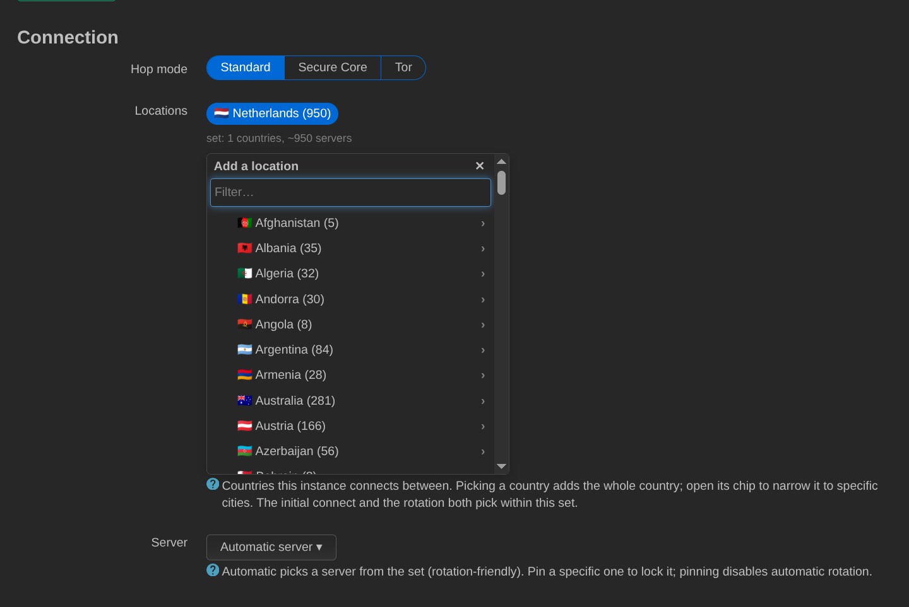
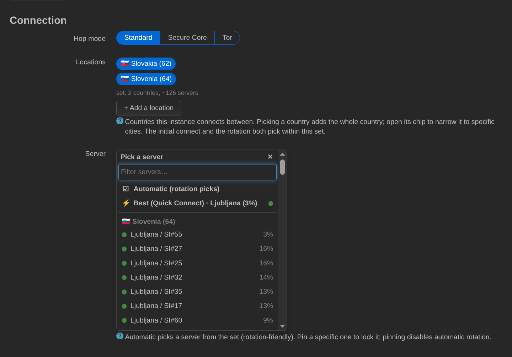
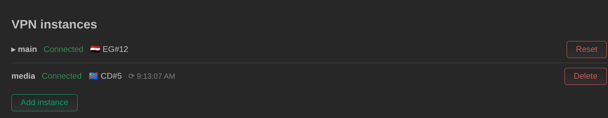
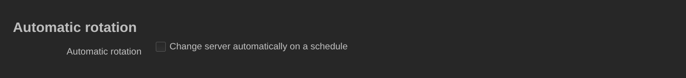

# Verwendung

[English](usage.md) · [Русский](usage.ru.md) · **Deutsch** · [← README](../README.de.md)

Öffne **VPN → ProtonVPN** und klicke auf **Log in** (Anmelden). Der Dialog
fragt nach deiner Proton-Adresse und deinem Passwort — und nach einem
TOTP-Code nur dann, wenn das Konto einen verwendet. Das Passwort wird im
Browser verarbeitet und nie an den Router gesendet. Die Serverliste wird direkt
nach der Anmeldung heruntergeladen; sie ist groß (Proton veröffentlicht
Zehntausende Server), deshalb dauert die erste Aktualisierung einige Sekunden.

Stelle dann ein **Standort-Set** (location set) zusammen — ganze Länder oder
einzelne Städte darin — und klicke auf **Save and reconnect** (Speichern und
neu verbinden). Sowohl die erste Verbindung als auch jede spätere Rotation
wählt aus diesem Set. Lass **Server** auf *Automatic*, damit das Backend nach
Last auswählt, oder pinne einen fest; das Anpinnen deaktiviert die Rotation für
diese Instanz.

Der **Hop-Modus** (Hop mode) schaltet zwischen Standard, Secure Core (Eintritt
über einen gehärteten, Proton-eigenen Server in einem datenschutzfreundlichen
Land) und Tor (Austritt über das Tor-Netzwerk) um. Die drei sind eigenständige
Produkte und keine Filter über einer gemeinsamen Liste, deshalb leert ein
Moduswechsel das Standort-Set: wähle für den neuen Modus neu aus.

Die Server sind nach geringster Last sortiert, mit der Auswahl des am wenigsten
ausgelasteten Servers ganz oben. Bei gleicher Last wird nach Namen sortiert,
numerisch — `NL#5` steht also vor `NL#27`, nicht dahinter:

Das Statusband zeigt den verbundenen Server, das Alter des Handshakes und die
durch den Tunnel sichtbare externe IP — die einzige Prüfung, die belegt, dass
der Traffic wirklich über das VPN hinausgeht, was ein Handshake allein nicht
tut.

## Mehrere Instanzen

Jede Instanz betreibt ihr eigenes WireGuard-Interface (`pv_<name>`), ihr
eigenes Schlüsselpaar samt Zertifikat, ihr eigenes Standort-Set und ihren
eigenen Zeitplan — und, sofern sie Traffic steuert, ihre eigene Routing-Tabelle
und Firewall-Zone. Gemeinsam genutzt werden ein Proton-Konto und ein
Serverlisten-Cache, die `main` besitzt. `main` zu löschen setzt die Instanz auf
die Standardwerte zurück, statt sie zu entfernen, denn sie verankert beides.

Typischer Einsatz: `main` für das LAN und eine zweite Instanz für ein
Gastnetzwerk oder ein Mediengerät, das in einem anderen Land austreten soll.

## Rotation und der Watchdog

Die Rotation wechselt auf einen anderen Server aus dem Set — entweder alle N
Minuten oder zu einer festen Tageszeit. Ein Kandidat wird erst akzeptiert, wenn
ein echter WireGuard-Handshake zustande kommt; andernfalls wird der nächste
Kandidat probiert und, falls keiner funktioniert, der vorherige Peer wieder
hergestellt.

Der optionale **Watchdog** verbindet neu, wenn der Tunnel veraltet — die
Erkennung erfolgt über den Handshake, ohne externe Probe — und hält sich
heraus, solange ein bestimmter Server angepinnt ist.

