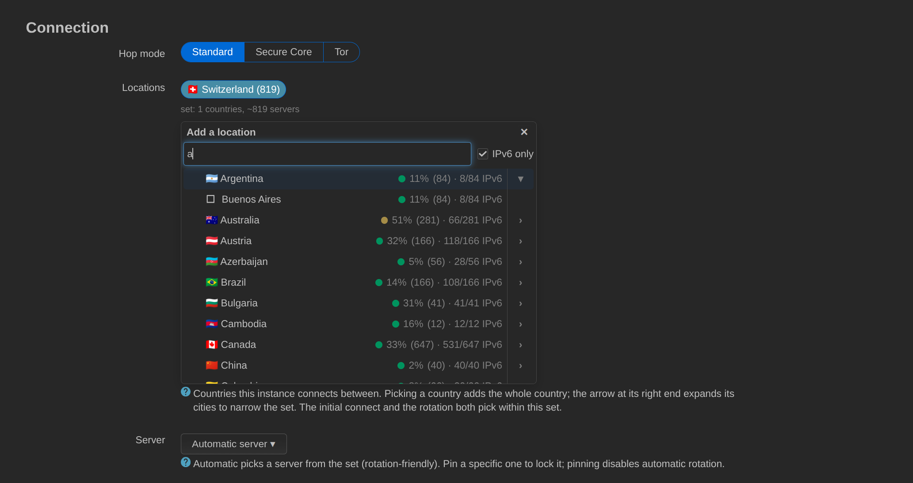

# Usage

**English** · [Русский](usage.ru.md) · [Deutsch](usage.de.md) · [← README](../README.md)

Open **VPN → ProtonVPN** and press **Log in**. The modal asks for your Proton
address and password, and for a TOTP code only if the account uses one — the
password is processed in your browser and never sent to the router. The server
list downloads right after login; it is large (Proton publishes tens of
thousands of servers), so the first refresh takes a few seconds.

Then pick a **location set**. The picker is an accordion: clicking a country
selects it whole, and the arrow at the right end of its row expands that
country's cities in place, so you can narrow the set to individual cities
without ever leaving the list. Each row shows the average load of its
gateways in the current hop mode. When the instance requires IPv6 gateways
(the *Only use gateways that forward IPv6* option, which applies to Automatic
IPv6 in Standard mode with steered routing), the row also counts how many of
its gateways qualify. The panel head adds an **IPv6 only** toggle next to the
filter box: with it on, countries and cities that have no IPv6-forwarding
gateways are left out of the list, and a line under the list says how many
were hidden — separately for countries and for cities, so the narrowing is
never silent. The per-row IPv6 count shows whenever the toggle is on, even
when the instance does not require IPv6. It is a view filter only — it
changes what the list shows, never what the instance saves or connects to;
that remains the *Only use gateways that forward IPv6* option, and the toggle
defaults to on when that option is already enabled. In Secure Core and Tor
the toggle is unavailable, because those gateways never forward IPv6 (the bit
is set on 0 of 122 Secure Core and 0 of 7 Tor logicals across the fleet).
Press
**Save and reconnect**. The initial connect and every later
rotation pick from that set. Leave **Server** on *Automatic* to let the backend
pick a server from the set at random, or pin one; pinning disables rotation
for that instance.

**Hop mode** switches between Standard, Secure Core (entry through a hardened
Proton-owned server in a privacy-friendly country) and Tor (exit through the
Tor network). The three are different products rather than filters over one
list, so switching mode clears the location set: pick again for the new mode.

Servers are listed least-loaded first, with a one-click lowest-load pick on
top. Within an equal load they are ordered by name, numerically — so `NL#5`
comes before `NL#27`, not after it:

The **Proton account** card at the top of the page is a single line while the
session is healthy — the state and the date the session runs to. It grows an
explanation only in the states that ask you to do something: an expired
session, a pending two-factor code, or no session at all. The client version
lives on that card under a disclosure whose summary always names the version
in force.

The state card below it is one line too — what the tunnel is doing, the server
it is on and where that server is — with the facts underneath as labelled
pairs: handshake age, IPv6, rotation, certificate, external IP and plan. The
external IP as seen through the tunnel is the one check that proves traffic
really leaves through the VPN, which a handshake alone does not. **Reconnect**
is always on the line; **Refresh**, **Rotate now** and **Disable** join it as
soon as the window is wide enough, and move behind the **⋯** button below
about 34em.

The locations you have chosen are listed under the picker, one row per
country: flag, name, how much of that country is in the set, and a × that
removes it. The row and the × are both reachable with Tab and activated with
Enter, as are the rows in both pickers. **Escape** closes either picker, and
so do its ✕ and picking a server — every one of them puts the keyboard back on
the button that opens that picker, never on the page behind it. Clicking the row reopens
that country's cities. A saved location the server list no longer knows is shown
dashed and reads *not in the server list*: it is still in the saved set and
still written back on every save, so it is shown rather than hidden — its ×
is the way to get rid of it. Proton lists a few
countries under codes Unicode has no flag for — Kosovo, which it sends as
`XK`, is the live case — and those show the two-letter code in a small badge
rather than the white-flag-with-a-question-mark glyph a made-up flag renders
as.

## Multiple instances

Every instance runs its own WireGuard interface (`pv_<name>`), its own keypair
and certificate, its own location set and schedule, and — when it steers
traffic — its own routing table and firewall zone. They share one Proton
account and one server-list cache, which `main` owns. Deleting `main` resets it
to defaults instead of removing it, because it anchors both.

Typical use: `main` for the LAN and a second instance for a guest network or a
media device that should exit in another country.

## Rotation and the watchdog

Rotation moves to another server in the set, either every N minutes or at a
fixed time of day. A candidate is only accepted once a real WireGuard
handshake completes; if it does not, the next candidate is tried and the
previous peer is restored if none work.

The optional **watchdog** reconnects when the tunnel goes stale — detection is
handshake-based, with no external probe — and stays out of the way when a
specific server is pinned.

